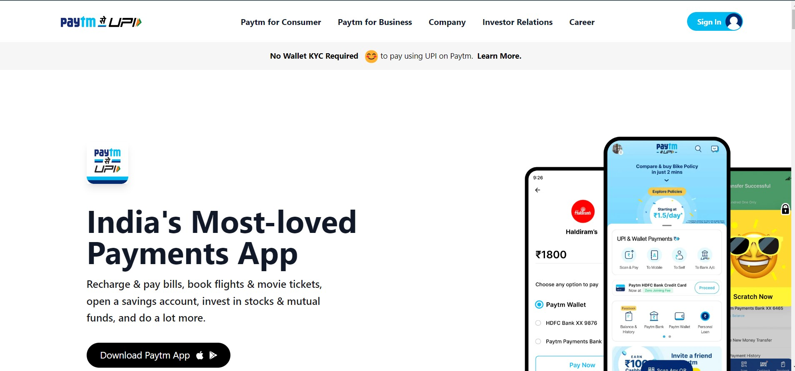

# 🎗️ **Paytm Clone** 🎗️

> ### 📱 **This is fully responsive website developed with HTML and Tailwind CSS**

 

## **Features**

👉 **Mobile Responsive First**

👉 This is my **First** project in **Tailwind**.

👉 It took me around **15** Hours to develop and make it fully **responsive**.

👉 Followed documentation for **Tailwind** Classes

👉 Compatible with **Mobile**, **Tablet**, **Laptop** and **Larger screens**

👉 This project doesn't contain External **CSS** File

👉 Major learnings are walkthrough documentaion, using flex concepts, mobile responsive first, Background-Image position using tailwind,

 

## Project Glimpse

 

 

## Contribution

Pull requests are welcome. For major changes, please open an issue first to discuss what you would like to change.

## Live Link

[Paytm Clone - CLICK ME!](https://16-abhishek-paytm-clone.netlify.app/)
